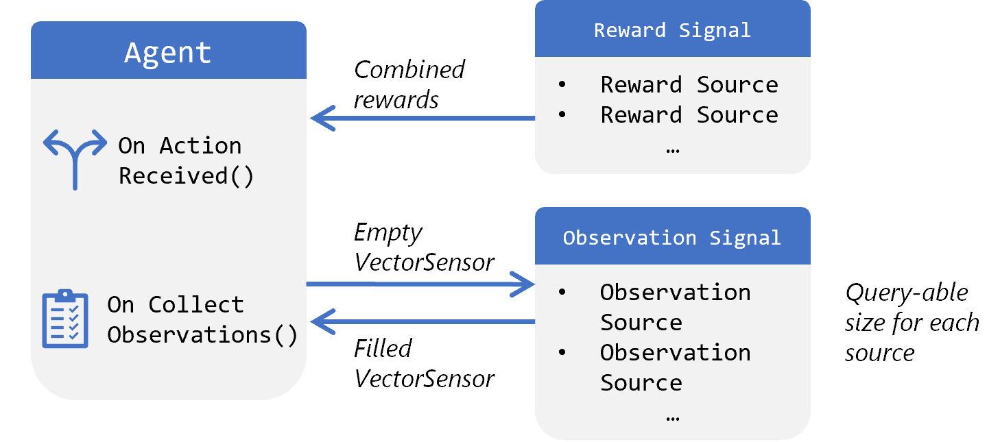
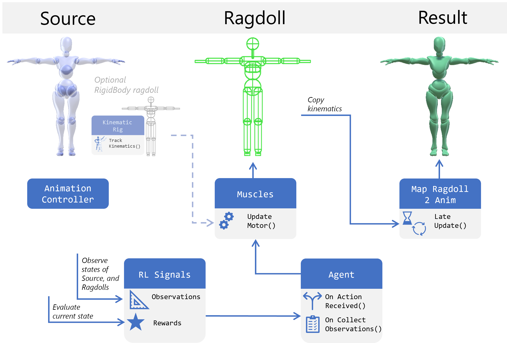
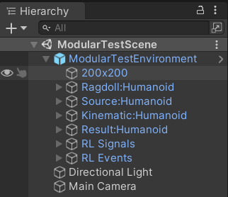
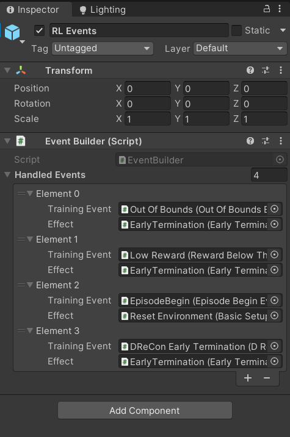

# Modular environments
## Introduction
Even before choosing the hyperparameters of a RL model, the assembly of the learning environment itself presents a huge amount of choices.
Variants of observations, rewards, training events and controllable characters lead to many combinations, making multi-purpose environments difficult to manage.

To help deal with this, we are working towards a modular approach where these learning elements are kept independent, with flexible interfaces between them. The main goal is to make these components reusable, combinable and versatile.

An example Unity scene using the current version of the modular components can be found in [`ModularTestScene.unity`](/../../UnitySDK/Assets/MarathonController/Scenes/ModularTestScene.unity).

## Overview

### `RewardSignal`
This class has a serialized private list of `RewardSource` objects. Its public `float` property `Reward`, is a mix of the `Reward` of the individual sources. This value is accessed by the Agent. Through a public `enum` various mixing methods can be selected. 

### `RewardSource`
This is an abstract class, inheriting from `MonoBehaviour`. You can implement a new RewardSource which can have an arbitrary approach to evaluating the current state of the environmnent. Since it is a `MonoBehaviour` you can have explicit serialized references to other objects in the hierarchy. It should expose its own public `Reward` property. A single reward source can internally be an arbitrary combination of different terms, as long as it makes sense to group them together.

Additionally, an `OnAgentInitialize()` method can be implemented to perform initialization tasks where Awake does not work.

### `ObservationSignal`
This class has a serialized private list of `ObservationSource` objects. It exposes the public method `PopulateSensorWithObservations(VectorSensor sensor)`, to which the Agent passes its empty `VectorSensor`. Individual `ObsservationSource`s add an arbitrary amount of observations to the provided sensor. This class alss exposes a public `int` property `Size`, which returns the sum of the `Size` of its sources.

### `ObservationSource`
Similarly to `RewardSource`, this too is a small abstract class that you need to implement. It exposes a `FeedStatesToSensor(VectorSensor sensor)` method and a `Size` parameter.

`ObservationSource` also has an `OnAgentInitialize()` method.

> Note: We use the term 'Observation' for what is often referred to as 'State' in literature, to avoid confusions with other occurences of the 'state' term in Unity.

### Agent
We are working on a suitable base class for the agent, but it will likely be extracted from the `DReConAgent` class. Each Agent instance has its own `RewardSignal` and `ObservationSignal` members. 

A particularly useful interface that your Agent could implement is `IEventsAgent`. This interface exposes a set of events called at decision and observation times, and for beginning of episodes. These can be subscribed to by other scripts, allowing them to monitor information about the agent.

#

### Environment Hierarchy

This figure illustrates an imitation learning evironment that is ready for training. The 'Source' object is a kinematic controller, with the learning objective to effectively mimic its movements with the physcially simulated 'Ragdoll' character. Finally, the dynamic character's generated movements are visualized with the 'Result' character.

The 'Kinematic' character represents the mapping between the source model and the ragdoll model, to ensure that kinematics of the animation have 1:1 equivalents in the ragdoll. This 'Kinematic' character can track the source animation to serve as a reference for observations and rewards, and use Rigidbodies for each body segment to conveniently interpolate velocities.
`KinematicRig` is the script that plays this role in the modular example scene.

The `Muscles` component associated with the Ragdoll manages the translation of actions produced by the Agent into commands for the `ArticulationBody` based ragdoll. In some setups (like in DReCon[^DReCon]) the 'Kinematic' character can serve as a baseline to modulate by the `Muscles`.

Finally, the last element to summarize is the 'RL Events' object.

This object pairs up `TrainingEvents` with `TrainingEventHandlers`. `TrainingEvents` monitor the training process and call all subscribed `TrainingEventHandlers`. This system allows you to have just one object monitor certain conditions (including monitoring the Agent's performance) and execute multiple effects if its triggered, or vice a versa. It can form the basis of early termination, exploring starts, curriculum learning and other behaviours of the learning environment.  

[^DReCon]: Bergamin, K., Clavet, S., Holden, D. and Forbes, J.R., 2019. DReCon: data-driven responsive control of physics-based characters. ACM Transactions On Graphics (TOG), 38(6), pp.1-11. 

