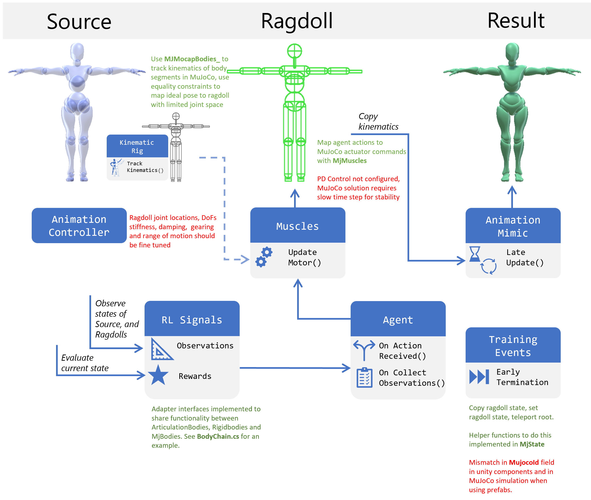

# MuJoCo Physics
## Introduction
PhysX is reasonably accurate for simulation, especially in humanoid kinematics settings. However, there are several reasons why one might be interested in substituting it for a different engine, such as MuJoCo, for Unity RL environments. 
*Compare fairly with existing learning environments in literature, in which MuJoCo has been used extensively
*Transfer results and insights to real life hardware. Thanks to the extra fidelity provided by MuJoCo there have been successful real life robotics projects pre-trained in simulation
*Take advantage of specific features and characteristics for game development / simulation. One example is the realistic muscle-tendon simulations in MuJoCo that could be used. The team at DeepMind appears to be moving towards the direction of making their engine more practical for game development specifically

This last point is indicated by the introduction of the arrival of the Unity plugin for MuJoCo (for real this time!). While its still being developed its already in a state where its possible to render and influence most MuJoCo scenes in Unity. 

## Installation of the Plugin
Installation guide is available [here](https://mujoco.readthedocs.io/en/latest/unity.html). I had some issues when importing the package, receiving warnings about the naming in assembly definition files, if you have this issue a solution is available [here](https://github.com/deepmind/mujoco/issues/129).

## About the plugin and MuJoCo
MuJoCo usually defines scenes and components/hierarchies within with an XML format. The [documentation for modelling mujoco scenes](https://mujoco.readthedocs.io/en/latest/modeling.html) is really useful, giving detailed descriptions and guidelines. Once the plugin is installed you can import most MuJoCo scenes. The importer parses the XML file, recreates and saves a version of that file for reference in the "Local/MjImports" directory along with any materials and meshes defined in the file. The Unity scene hierarchy is the populated with counterparts of the MuJoCo components. If any component MuJoCo component exists when the scene is played, an `MjScene` singleton is instantiated, that synchronises the state of the Unity scene and the MuJoCo simulation running in the background through the DLL. The state of the MuJoCo simulation can be influenced through a number of ways:
*Through actuators, which articulate predefined degrees of freedom via an exposed `Control` field. These are used by the trained Agent to control locomotion of the simulated character.
*Through `MjMocapBodies`, which take the transform of the Unity `GameObject` they are attached to and update the corresponding object in simulation. I've had issues with the component not working as intended, and experimented with addressing the memory it maps the transform to slightly differently until it worked as expected, but it may break in a future update of the plugin.. I named that component `MjMocapBody_`. Through equality constraints you can move physics objects around in the MuJoCo simulation. Another thing to note is the importer seems to import `MjMocapBodies` as only `MjBodies`, therefore you may need to replace them manually, and also update the corresponding references to that component such as in equality constraints.
*By editing appropriate shared memory addresses in `MjScene.Data`. This is an unsafe operation so a bit of extra care is needed. I use this when I reset the animation state on Early Termination for example.

Unless you impact the simulation through one of these ways, there is no interaction between Unity physics and Mujoco (e.g. no collisions between Unity and Mujoco objects).

Reading the state of the simulation can be performed similarly, by reading the state of designated `Sensor` objects defined in the XML, reading exposed properties of `MjBodies`, joints and controllers, or again through reading the appropriate field of `MjScene.Data`.

I added a couple of helpful functions for reading and setting simulation state in a static class called `MjState`.

## Overview of the example learning environment

The example walking environment in this branch is based on the "modular" components, a general overview of which is also available in the appropriate folder of the documentation. Early versions of the appropriate adapters for swapping articulation bodies with the MuJoCo simulation have been implemented, which are indicated in the figure below. 

## Open issues
*The character used right now was recreated in the MuJoCo XML format by hand based on the ragdoll used by MarathonEnvs. I have made a few inaccuracies with regards to degrees of freedom, and joint location. The degrees of freedom were reduced a bit on purpose to have a bit less components needed in MuJoCo.
*Motors actuate torque directly, there is no PD control implemented, which may increase the "cognitive burden" on the agent. Positional control is easy to implement in MuJoCo actuators, but I've been having trouble with stability by including velocity components. In test scenes I had to greatly reduce the timestep (<0.005s) or would have to use tiny differential gains. I think PD control could be implemented in Unity and drive the torques that way, or just P control could be used with damping enabled on the joints.
*Referencing specific components through their IDs seems to have some issues when using prefabs containing `MjComponents`. This is apparent when I try to teleport the kinematic ragdoll to the start, the ID of the hip free joint seems to refer to a different component. By trial and error I found the ID of that free joint that works when cloned from a prefab, but this is a very hacky solution which leads to issues.
*Training on multiple environments concurrently. Using multiple instances (i.e. through `--num-envs`) works fine, but `ManyWorlds` style learning (`--num-spawn-envs` > 1) within a single instance doesn't work yet. This is partially caused by issues of referencing components instantiated from prefabs, and perhaps on a bigger level, I think there are issues since cloned components don't have unique identifiers. One solution would be to create (manually or automatically) unique versions of the simulated character with unique names, and load them at runtime as needed. A potential benefit would be the opportunity to share resources between environment. 
